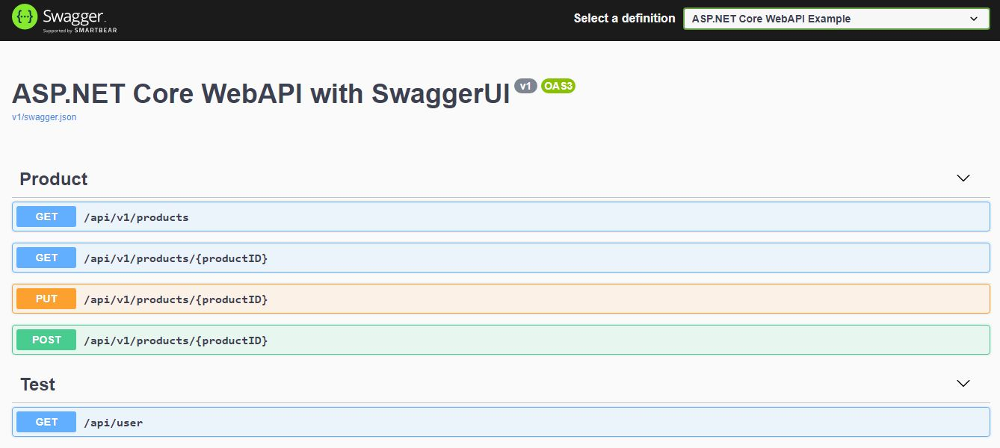

# ASP.NET Core WebAPI with SwaggerUI

ASP.NET Core Web API example with SwaggerUI. This project includes sample GET and POST api with versioning.

Format: 

## Install Below Packages from Nuget Package Manager 
1. Microsoft.AspNetCore.StaticFiles
2. Swashbuckle.AspNetCore (SwaggerUI)

SwaggerUI run on https://localhost/5001/swagger
